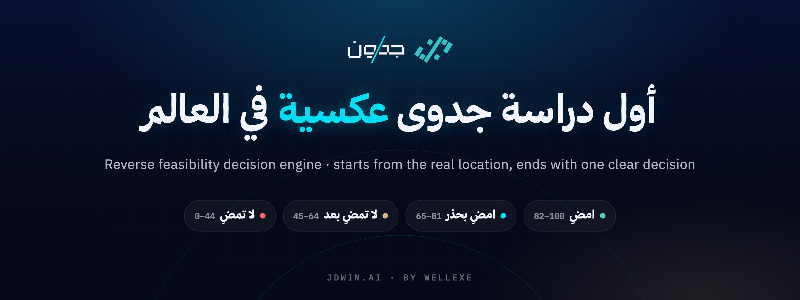

<p align="center">
  <a href="https://jdwin.ai">
    
  </a>
</p>

<p align="center">
  <a href="https://jdwin.ai"><b>jdwin.ai</b></a>
  &nbsp;·&nbsp;
  <a href="https://jdwin.ai/ar/docs">التوثيق</a>
  &nbsp;·&nbsp;
  <a href="https://jdwin.ai/en/docs">Docs</a>
  &nbsp;·&nbsp;
  <a href="https://jdwin.ai/ar/jadwal">جدوِل</a>
  &nbsp;·&nbsp;
  <a href="https://x.com/JDWIN_AI">X</a>
  &nbsp;·&nbsp;
  <a href="https://jdwin.ai/ar/wellexe">Wellexe</a>
</p>

<br />

<div dir="rtl" align="right">

## جدوِن في سطرين

**جدوِن (JDWIN)** محرّك قرار متخصص في **دراسات الجدوى العكسية**. تبدأ الدراسة التقليدية من فكرة ثم تبحث لها عن موقع؛ أما جدوِن فيبدأ من **الموقع الحقيقي على الأرض**، ويقرأ طلبه ومنافسيه وحركته ووصوله، ثم يُسلّمك **مؤشّرًا من 100 وقرارًا واحدًا واضحًا** قبل أن تُنفق ريالًا واحدًا.

> ليس واجهةً فوق نموذج لغوي عام. النماذج اللغوية تفهم وصفك وتصوغ الشرح؛ أما الأرقام فتأتي من قياسات وطبقات بيانات مُسنَدة، ويبيّن كل تقرير مصدر كل طبقة فيه.

### كيف تصل إلى القرار

| | الخطوة | ما يحدث |
|:-:|---|---|
| **١** | **صِف مشروعك** | بلغتك الطبيعية: «مقهى مختص في حي الملقا، الرياض» |
| **٢** | **أكّد المكان** | يُثبَّت الموقع على الخريطة قبل أن يبدأ أي تحليل |
| **٣** | **استلم القرار** | مؤشّر جدوِن من 100، وقرار من أربع درجات، وتقرير يشرح لماذا |

### نطاقات القرار الأربعة

| المؤشّر | القرار | المعنى |
|:-:|:-:|---|
| **82 – 100** | 🟢 **امضِ** | نطاق قوي |
| **65 – 81** | 🔵 **امضِ بحذر** | فرصة مشروطة بمعالجة نقاط محدّدة |
| **45 – 64** | 🟡 **لا تمضِ بعد** | المخاطر تفوق الفرصة حاليًا |
| **أقل من 45** | 🔴 **لا تمضِ** | لا يُنصح بالمضي في هذا الموقع |

«امضِ» غير المشروطة محجوزة للنطاق الأعلى وحده: درجة 81 هي «امضِ بحذر».

### ما يقرؤه المحرّك

أربعة مؤشّرات رئيسية: **الطلب والسوق** · **المنافسة والفجوة** · **الوصول والحركة** · **مستوى المخاطر**، تحتها متغيّرات تفصيلية كتصنيف الشارع ووضوح الواجهة وكثافة الحركة والمواقف وتشبّع المنافسة. ويُصرّح التقرير بكل طبقة تعذّر قياسها بدل أن يخفيها.

### ما لا يدّعيه

- لا يقيس جودة التنفيذ أو الإدارة.
- لا يتنبّأ بالمفاجآت: تغيّر تنظيمي، منافس جديد، مشروع بنية تحتية.
- الأرقام المالية نطاق استرشادي لا التزام، والدقّة تتفاوت بحسب توفّر البيانات في كل منطقة.

### جدوِل

**جدوِل (Jadwil)** خدمة الوكلاء والجدولة في جدوِن: وكلاء عمل تُوظّفهم على أيام أسبوعك، يراقبون ويجهّزون ويسلّمون، ولا يكتبون أو يرسلون باسمك إلا بعد موافقتك. ← [jdwin.ai/ar/jadwal](https://jdwin.ai/ar/jadwal)

</div>

<br />

## In English

**JDWIN (جدوِن)** is a decision engine for **reverse feasibility studies**. A conventional study starts from an idea and looks for a place; JDWIN starts from **the real place**, reads its demand, competition, movement and access, and returns **an index out of 100 and one clear decision** before any money is spent.

| Index | Decision | Meaning |
|:-:|:-:|---|
| **82 – 100** | **امضِ** · Proceed | A strong band |
| **65 – 81** | **امضِ بحذر** · Proceed with care | An opportunity conditional on specific fixes |
| **45 – 64** | **لا تمضِ بعد** · Do not proceed yet | Risk outweighs opportunity for now |
| **below 45** | **لا تمضِ** · Do not proceed | Not advised at this location |

Describe the venture in plain language, confirm the place on the map, and receive the index, the decision and a report that explains it, with the source of every data layer stated. Arabic-first; location analysis works worldwide.

<br />

## Skill · `jdwin-site-brief`

A ready-to-use **Agent Skill** that turns a business idea and a place into a precise request for JDWIN, and then helps read the decision that comes back. It asks the questions a good request needs (the venture, the exact place, the budget, the customers, the hours), catches the gaps that weaken an analysis, and hands back one line to paste into JDWIN, in Arabic and English.

```
skills/jdwin-site-brief/
├── SKILL.md                     the skill
└── reference/
    ├── reading-the-decision.md  the four bands, the index, the stated limits
    └── examples.md              good and weak requests, side by side
```

**Use it**

- **Claude Code** · copy the folder into `~/.claude/skills/` (or a project's `.claude/skills/`).
- **Claude apps** · zip the `jdwin-site-brief` folder and upload it under *Settings → Capabilities → Skills*.
- **Any other agent** · `SKILL.md` is plain Markdown with a short front-matter; give it to the agent as instructions.

> The skill contains no part of JDWIN's system. It prepares a request and explains public facts about the result; the analysis itself runs only at [jdwin.ai](https://jdwin.ai).

<br />

## This repository

| Included | Not included |
|---|---|
| A public introduction to JDWIN | Application or engine source code |
| The `jdwin-site-brief` skill | Architecture, models, prompts or scoring logic |
| The official symbol mark | Keys, configuration or any customer data |

Security reports about the live service go to [jdwin.ai support](https://jdwin.ai/en/support), never to public issues. See [SECURITY.md](SECURITY.md).

<br />

<p align="center">
  <a href="https://jdwin.ai/ar/terms">الشروط والأحكام</a> · <a href="https://jdwin.ai/ar/privacy">سياسة الخصوصية</a>
  <br />
  <sub>© 2026 <a href="https://jdwin.ai/ar/wellexe">Wellexe لتقنية المعلومات</a> · س.ت. 7055046747 · جميع الحقوق محفوظة</sub>
  <br />
  <sub>طلب براءة اختراع سعودي SA 1020264706 · تحت الإجراء</sub>
</p>
