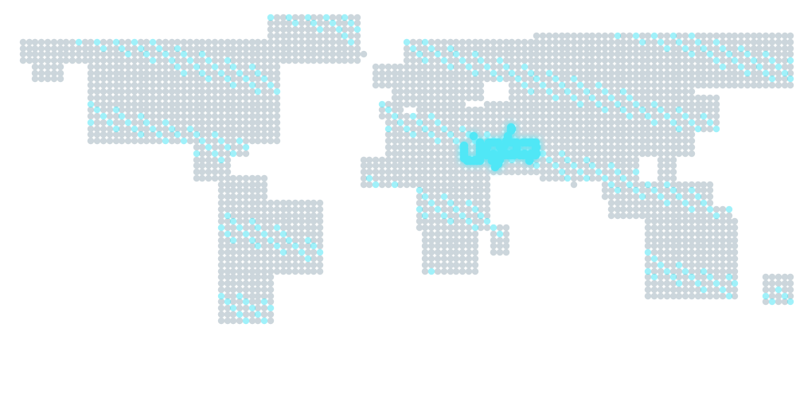
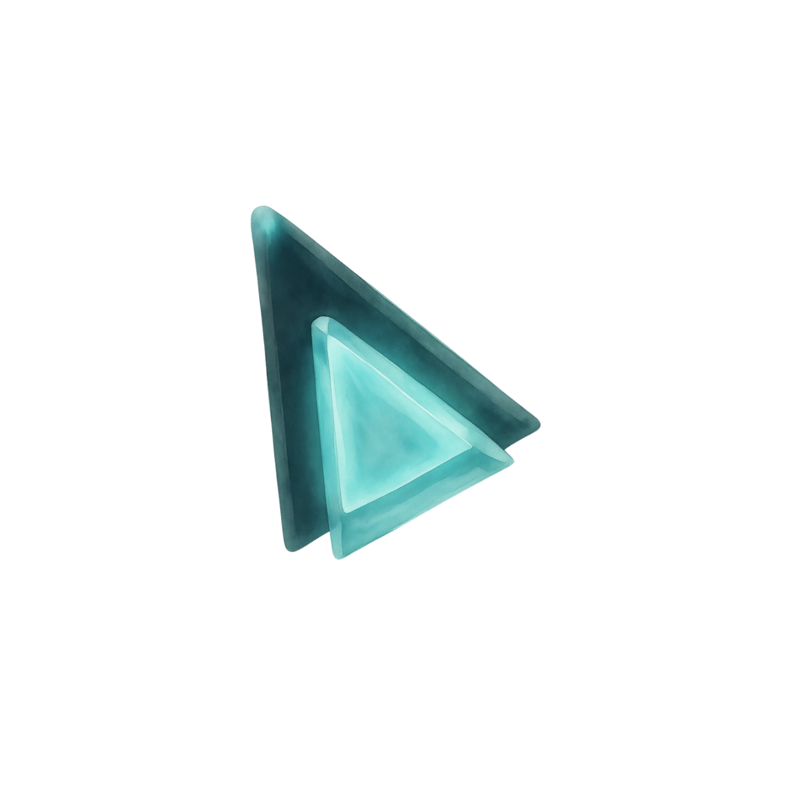

  

  <strong>The world’s first reverse-feasibility decision platform.</strong> 
  Start from a <em>real place</em> on the map — not from a blank business plan — and receive a clear <strong>GO / NO-GO</strong> verdict inside a <strong>certified jdwin report</strong>.

  <a href="https://jdwinai.com">Product website</a>
  ·
  <a href="https://jdwinai.com/en/docs">Public documentation</a>
  ·
  <a href="https://jdwinai.com/en/map">Try the map</a>

---

## About this repository

**This is a public, informational repository only.**

It exists to introduce **jdwin** (جدوِن) — what the product is, who it serves, and how the decision journey works at a product level. It does **not** contain application source code, infrastructure configuration, API keys, credentials, scoring internals, or any operational secrets.

For the live product, visit **[jdwinai.com](https://jdwinai.com)**.  
For approved product documentation, visit **[jdwinai.com/docs](https://jdwinai.com/en/docs)**.

---

## What is jdwin?

**jdwin** (جدوِن — Arabic for *feasibility*) is a **reverse-feasibility** platform built for capital courage.

Traditional feasibility studies often begin with assumptions, spreadsheets, and long timelines. **jdwin inverts that model:**

| Traditional feasibility | jdwin (reverse feasibility) |
|-------------------------|-----------------------------|
| Starts from a business plan or idea on paper | Starts from a **confirmed real-world location** |
| Produces long, ambiguous dashboards | Returns a **binary verdict: GO or NO-GO** |
| Buries the decision in caveats | Delivers judgment inside a **certified report** |
| Geography is an afterthought | Geography is the **anchor** of every analysis |

You describe your sector and intent in natural language (including Arabic voice input), **confirm the real place name** on an interactive map, and jdwin returns a structured outcome: indicators, a **Jadwen Index (0–100)**, and an unambiguous **GO / NO-GO** stamp — all within a report you can trust, share, and archive.

> **Product truth:** jdwin never exposes a three-state primary verdict. The user-facing decision is intentionally binary — **GO** or **NO-GO** — because capital decisions require a clear edge, not a decorative “maybe.”

---

## How it works

  

### Three steps from idea to decision

1. **Describe in natural language**  
   Write your idea as you would tell a friend — sector, intent, and context. No complex forms. Example: *“Would a specialty café work near King Saud University in Riyadh?”*

2. **Confirm the real place**  
   Smart search resolves likely locations; you **must confirm the actual place name** before analysis begins. A map pin locks geography — not bare coordinates — as the truth anchor.

3. **Receive a certified verdict**  
   Progress appears inside a single report surface. The outcome is binary: **GO** (proceed) or **NO-GO** (do not proceed), supported by tier-appropriate indicators and an official jdwin certification mark.

  

---

## Core concepts

### Reverse feasibility

Analysis flows **from the world inward**: real geography, competitive context, sector signals, and economic indicators converge into a single decision surface. You do not manage data sources, engine modes, or intermediate dashboards — the product absorbs that complexity and returns judgment you can act on.

### Binary verdict (GO / NO-GO)

| Verdict | Meaning |
|---------|---------|
| **GO** | High feasibility — proceed with confidence |
| **NO-GO** | Elevated risk — do not proceed on this basis |

There is no user-facing “caution” or “wait” stamp. jdwin owns analytical clarity; you own execution.

### Certified report

Every completed analysis produces a **jdwin-certified report** — a single trustworthy document that carries the verdict, indicators, and (by entitlement tier) deeper layers such as financial estimates, risk framing, recommendations, and exportable PDF.

  

### Value layers (Free → Pro → Max)

jdwin deepens with your need for depth — without changing the binary nature of the verdict:

| Layer | What you get (product surface) |
|-------|--------------------------------|
| **Free** | Binary GO / NO-GO · core indicators · limited analyses |
| **Pro** | Deeper location and sector intelligence · financial framing · executive summary |
| **Max** | Full indicator depth · advanced recommendations · highest analysis quota |

Higher tiers unlock **more depth inside the same certified report** — not a different kind of verdict. Payments are processed through **Ramz** (رمز), a Saudi payment provider.

---

## Who jdwin serves

- **Individual investors & founders** validating an idea before committing capital or presenting to partners  
- **Executive teams** needing a single report that carries the decision from place confirmation to judgment  
- **Operators & analysts** comparing locations side-by-side and archiving decisions in a personal vault  
- **Partners & institutions** seeking high-level integration philosophy — formal onboarding required for operational access

Visitors can browse marketing and documentation freely. The analytical map, personal reports, and vault require an authenticated account.

---

## Product surfaces (public overview)

| Surface | Purpose |
|---------|---------|
| **Landing** | Product story, pricing preview, entry to the map |
| **Smart map** | Worldwide place selection and analysis launch |
| **Report** | Inline progress, gauge (0–100), GO / NO-GO stamp, tiered indicators |
| **Compare** | Side-by-side location comparison with a clear winner |
| **Packages** | Pro / Max / Ultra study packages (Ramz checkout) |
| **Vault** | Archived certified reports |
| **Docs** | Approved product truths — usage, entitlements, security, FAQ |

Arabic-first experience with full RTL support; English shell available at `/en`.

---

## Brand identity

  

- **Name:** jdwin (جدوِن)  
- **Category:** Reverse-feasibility · AI decision intelligence  
- **Primary site:** [jdwinai.com](https://jdwinai.com)  
- **Design language:** Warm cream product surfaces · liquid-glass marketing depth · Finjan display typography · single cyan accent moment per screen

Assets in `/assets` are provided for **illustration and press use** in connection with jdwin product communication. They are not licensed for unrelated commercial reuse without permission.

---

## What is **not** in this repository

To protect users, partners, and the integrity of the platform, the following are **intentionally absent**:

- Application source code (frontend, backend, scoring engine, infrastructure)  
- Environment variables, API keys, webhook secrets, or database credentials  
- Internal architecture diagrams, AGT kernel specifications, or model prompts  
- Admin consoles, partner operational tools, or security runbooks  
- Customer data, evaluation corpora, or production telemetry

Engineering, security review, and partner integration requests should go through **official channels** after formal engagement — not through public issue trackers on this repository.

---

## Responsible use & disclaimer

jdwin provides **analytical clarity** for feasibility decisions. It does **not** guarantee business outcomes, replace licensed professional advice, or assume liability for how you execute a project. The GO / NO-GO verdict is a structured analytical output; implementation risk remains with the decision-maker.

For privacy practices and data handling, see the live **[Privacy Policy](https://jdwinai.com/en/privacy)** and **[Terms of Service](https://jdwinai.com/en/terms)** on jdwinai.com.

---

## Contact & links

| Resource | URL |
|----------|-----|
| Website | [https://jdwinai.com](https://jdwinai.com) |
| Documentation | [https://jdwinai.com/en/docs](https://jdwinai.com/en/docs) |
| Support | [https://jdwinai.com/en/support](https://jdwinai.com/en/support) |
| Partners | [https://jdwinai.com/en/partners](https://jdwinai.com/en/partners) |

---

   
  © 2026 jdwin · Reverse feasibility · Certified decisions

